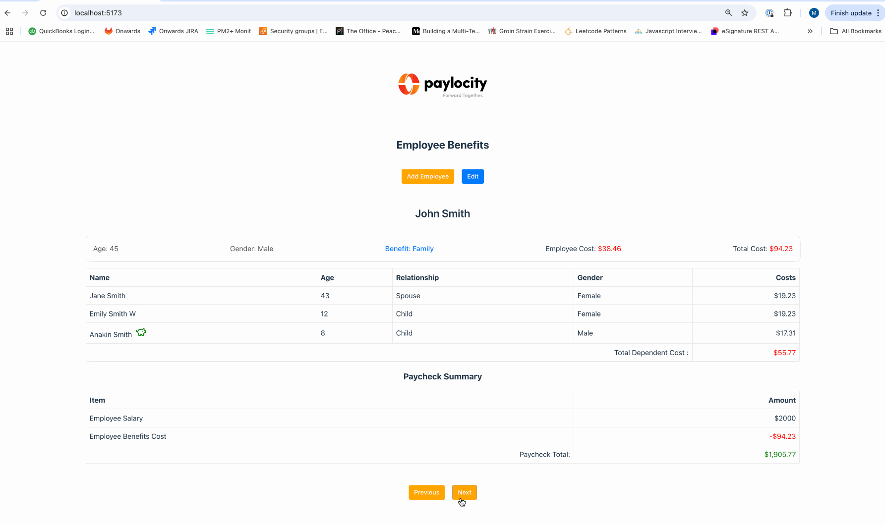

# Paylocity Benefits Calculator

## Setup & Run Instructions

1. Install dependencies: `npm install`
2. Start the app: `npm run dev`
3. Open `http://localhost:5173` in the browser

## Technologies Used

- React 18
- TypeScript
- Vite
- LocalStorage for persistence

## Features

- CRUD operations for employees and dependents
- Real-time benefits calculation as inputs are updated
- Custom benefit calculation logic

## Concerns
- Was not able to immeditately understand from the requirements if a list page of employees was required.  Went with a scrolling approach to demostrate different employees and their states. Just to break from the norm of list page/edit views we are surrounded by! This also simplifies the project in that no routing is used in the POC.

## Demo

